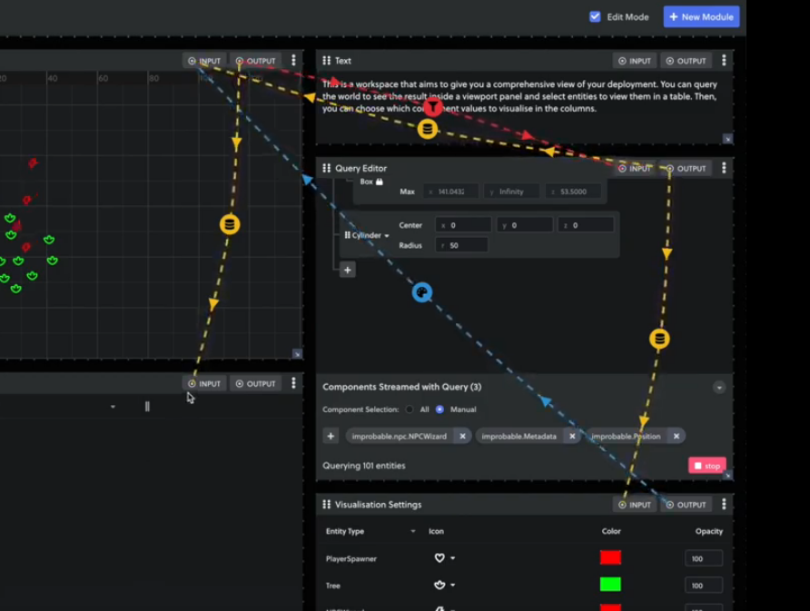

Improbable, the developers of SpatialOS, recently released an [alpha preview of their new Modular Inspector](https://docs.improbable.io/reference/13.6/shared/operate/modular-inspector), and boy is this thing :fire: HOT :fire:. When I first saw the demo videos, I was blown away by the sheer ingenuity of the design. In particular, I'm impressed by how well the new inspector is designed to give the user the power to wrangle complex worlds and see exactly what information they care about.

Since I'm part of the ongoing process to put together an [editor for Amethyst](https://github.com/amethyst/amethyst-editor), I want to go into some deeper detail about why this new inspector is so brilliant. ECS is starting to become a more widely-recognized paradigm in the gamedev community, but I think there's a lot of confusion around how you make ECS as comprehensible and easy to use as the existing Object Oriented paradigms. I think the SpatialOS Modular Inspector is the first graphical tool to really demonstrate how this is possible.

## Queries, Not Hierarchies 

The biggest thing that the Modular Inspector does is replace the traditional hierarchy view that's common in game editors with a tool for building dynamic queries over the contents of your world.	

In most editors that come with game engines, the default scene view is a nested hierarchy based on parent/child relationships between objects. For example, this is the Hierarchy view in the PlayCanvas editor:

This is also the provided scene view in Unity (in the Hierarchy view) and Unreal (in the World Outliner). While this view is often comfortable and familiar for game developers, it maps poorly to ECS, where the vast majority of your game logic is oriented around flat lists of entities, grouped by which components they have. As such, the Query Editor in the SpatialOS inspector is a brilliant paradigm shift because it means that the graphical inspector for you game operates on the same logic that your systems (or workers, in the case of SpatialOS) do: It queries the world with a set of constraints (usually the presence or absence of certain component types) and gets back a flat list of all entities matching the specified criteria.

## Modular, Composable Tools

The Query Editor itself doesn't actually show the results of the query, though. Instead, the query's output is piped into one or more other modules that are used to visualize the entity data. This highlights the next big thing that the SpatialOS inspector does well: It builds upon a modular set of tools that can be composed by piping the output of one module into another.

This is brilliant for two reasons:

* It's a truly modular approach to constructing your UI. Each module takes specific inputs to configure it, but doesn't specify where those configuration values need to come from. As such, you can manually set values yourself, use the output from another module, use values set on components/workers, or any other source of data that the inspector supports. While the SpatialOS inspector isn't itself extensible, one can easily imagine this same model working well with custom extensions and plugins, where user-defined plugins can easily communicate through data inputs and outputs.
* It puts the emphasis on data and how it flows through the components of your UI. Data flow is a big part of the ECS paradigm, and modeling our UI tools around data flows means that they fit more naturally with our intuition of how our games work.

The SpatialOS team clearly took inspiration from visual scripting tools here, where this model of nodes connected by data inputs and outputs is common. However, this is the first time I've seen the paradigm applied to constructing custom UI configurations, and I'm impressed at how well the paradigm works in the context of making a customizable UI.

## Different Visualizations for Different Situations

The Modular Inspector also provides different customizable ways of visualizing component data on the entities in your query. The Viewport provides a 2D visualization of the positions and movement of entities in a specified area, and the Entity Table provides a direct look at specific fields of the components attached to those entities. Both of these modules can be customized: You can tweak the colors and icons used for different entity types in the Viewport, and you can select which components and fields are displayed in the Entity Table. Combined with the fact that you can have multiples of each, all driven by different queries, these tools provide you tons of control over how you visualize the data in your world.

## It Looks Really Good

I mean damn, just look at it :eyes:

## Applying This to Other Engines/Editors

It's worth noting that the tools that Improbable has put together are clearly focused on one thing: Debugging ECS worlds. These tools have little use when it comes to authoring content for your game, but are incredibly useful when it comes time to verify that your world simulation is doing what you expect. As such, I think there's a lot we can learn from these tools in order to build better debugging tools for Amethyst and other ECS-based game engines.